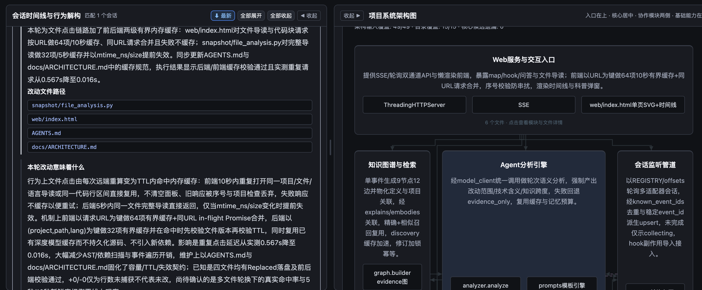
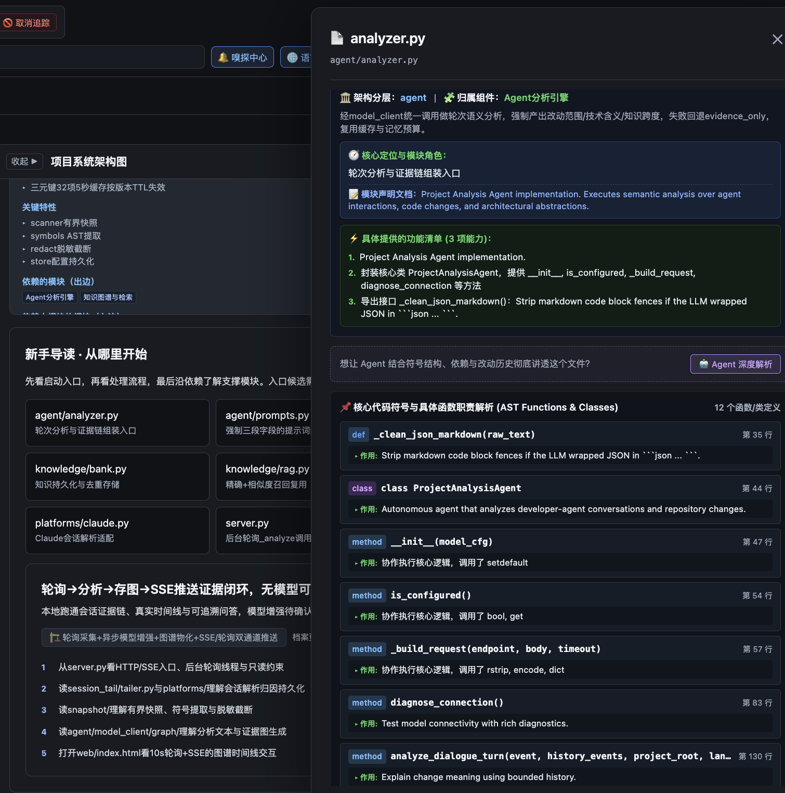
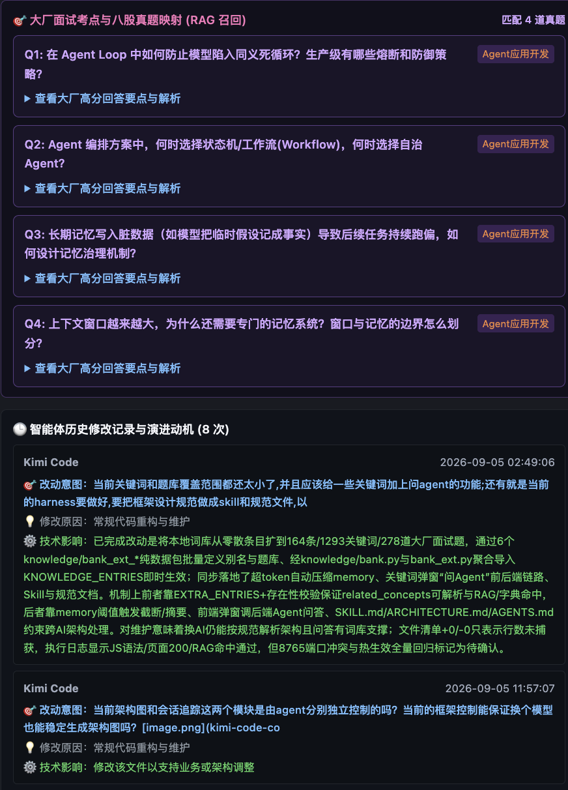

# vibe-learning

<p align="center">
  <h2 align="center">Let agents build. Understand what they build. Learn as you go.</h2>
  <p align="center">
    A local, read-only project understanding and continuous learning engine for AI coding agents.
  </p>
  <p align="center">
    <a href="#quick-start"></a>
    <a href="#privacy--safety"></a>
    <a href="#how-it-works"></a>
    <a href="#supported-agents"></a>
    <a href="#roadmap"></a>
  </p>
  <p align="center">
    <a href="#why-vibe-learning">Why vibe-learning?</a> •
    <a href="#demo">Demo</a> •
    <a href="#key-features">Key Features</a> •
    <a href="#quick-start">Quick Start</a> •
    <a href="#how-it-works">How It Works</a> •
    <a href="#supported-agents">Supported Agents</a> •
    <a href="#privacy--safety">Privacy & Safety</a> •
    <a href="#roadmap">Roadmap</a>
  </p>
</p>

---

## Why vibe-learning?

Autonomous coding agents (Claude Code, OpenAI Codex, Kimi Code, etc.) can generate, refactor, and modify dozens of files across a large codebase in minutes. While development velocity accelerates, **human project comprehension drops rapidly**:

- **Context Fragmentation**: *What did the agent actually change across 15 different files?*
- **Rationale Vacuum**: *Why did it introduce this specific abstraction or dependency?*
- **Architectural Drift**: *How do these automated changes impact system boundaries and imports?*
- **Learning Debt**: *How can engineers truly master the codebase instead of blindly rubber-stamping agent PRs?*

**vibe-learning is an independent out-of-band observer and learning companion.** It runs purely on local loopback, non-intrusively monitors agent sessions and filesystem diffs, and continuously translates raw agent activity into an interactive architectural blueprint, an evidence-grounded change timeline, and contextual engineering knowledge.

> **Core Philosophy**: Your coding agent builds the code. vibe-learning ensures you understand, verify, and master what is being built.

---

## Demo

<div align="center">

### 1. Living Architecture Blueprint & Change Timeline
*Track real-time code modifications alongside high-level system architecture. Jump seamlessly from change events into deep file analysis.*

<p align="center">
  
</p>

### 2. File Guide: Entry Points, Symbols & Code Blocks
*Understand any source file at a glance: module membership, AST classes/methods, static dependencies, and bounded local code previews.*

<p align="center">
  
</p>

### 3. Learn in Context: Targeted Questions & Modification History
*Connect real-world code changes with computer science fundamentals, design patterns, and targeted interview-style questions.*

<p align="center">
  
</p>

</div>

<sub>*Note: Screenshots represent actual development runs. Specific model identifiers in development snapshots have been sanitized. Questions labeled as practice items represent curated engineering topics unless an official source link is provided.*</sub>

---

## Key Features

### 🏗️ Deterministic Architecture Map
- **Layered Hierarchy**: Automatic classification into Presentation, Agent & Core Logic, Pipeline & Stream, and Infrastructure layers.
- **Dual-Source Relationships**: Clear visual distinction between concrete code imports (solid lines) and model-inferred semantic connections (dashed lines).
- **Interactive Inspection**: Click any component to reveal responsibilities, key features, directory boundaries, and full file inventories.
- **Bidirectional File Tree**: Explore inward and outward dependencies for every single file without arbitrary depth cutoffs.

### ⏱️ Semantic Change Timeline
- **Noise-Free Distillation**: Automatically filters out internal agent system prompts, chain-of-thought scratchpads, and retry loops.
- **Physical Evidence Anchoring**: Requires confirmed filesystem diffs (files, additions, deletions) before attributing changes; ignores hallucinated claims.
- **Technical Impact Summaries**: Generates concise, 1–3 sentence summaries explaining the engineering rationale and architectural impact of each round.
- **Continuous Ingestion**: Initial observation captures recent completed rounds; subsequent changes stream in real-time.

### 🧭 Intelligent Onboarding & File Guides
- **Where to Start**: Automated entry-point candidate detection and suggested reading order for unfamiliar codebases.
- **AST Symbol Extraction**: Extracts classes, functions, docstrings, line numbers, and static call references.
- **Local Code Inspection**: Bounded, on-demand code block expansion with line numbers and credential masking—source code never enters model prompts.

### 💡 Context-Aware Engineering Knowledge & Q&A
- **Curated Knowledge Bank**: Built-in repository of 240+ software engineering concepts and 430+ technical questions across Frontend, Backend, Agent Algorithms, Post-Training, and System Fundamentals.
- **RAG-Powered Relevance**: Lightweight BM25 retrieval matches applicable engineering principles and design trade-offs to the file currently in view.
- **Ask on Any Selection**: Highlight any word or sentence (up to 2,000 characters) in explanations to ask follow-up questions.
- **Dual-Layered Answers**: Separates a concept's universal definition from its concrete role in your specific repository.
- **Cross-Project Cache Reuse**: Universal definitions are cached across repositories, while project-specific insights remain strictly sandboxed.

### ⚡ Non-Blocking Asynchronous Pipeline
- **Decoupled Workers**: Event tailing, dialogue analysis, and architecture revisions run on isolated bounded queues.
- **Graceful Degradation**: If an external analysis model is unconfigured or rate-limited, events remain fully accessible as `evidence_only` without interrupting tracking.

---

## Quick Start

### Prerequisites
- Python 3.9+
- A modern web browser
- Zero external package dependencies (built strictly with Python standard library)

### 1. Clone & Start
```bash
git clone https://github.com/wudilyy999/vibe-learning.git
cd vibe-learning

# Launch observer for your target project directory
python3 server.py --project /path/to/your/local/repo --port 8765
```

### 2. Open Web Dashboard
Navigate to [http://127.0.0.1:8765](http://127.0.0.1:8765) in your browser.

Use the **Discovery Center (嗅探中心)** in the top bar to inspect subdirectories or add additional project folders when your agent operates from a broad parent workspace.

---

## How It Works

```text
  Agent Session Logs (~/.claude, ~/.codex, etc.)
                      │
                      ▼
        Read-Only Session Tailer & Round Parser
                      │
                      ▼
     Project Attribution & Idempotent Event Store
                      │
           ┌──────────┴──────────┐
           ▼                     ▼
   Real-Time Event Stream    Asynchronous Analysis Queue
   (SSE: /api/events/stream)      │
           │                     ▼
           │             Optional LLM Analysis
           │             (Sanitized Metadata Only)
           │                     │
           └──────────┬──────────┘
                      ▼
     Interactive Map, Timeline & File Guides
```

1. **Passive Log Tailing**: Periodically reads append-only session JSONL files from supported agent directories.
2. **Deterministic Round Chunking**: Segments interaction streams into distinct user rounds, verifying file changes with filesystem snapshots.
3. **Local Event Persistence**: Writes events to `~/.vibe-learning/` with file locks and idempotent `(session_id, turn_id)` deduplication.
4. **Asynchronous Enrichment**: If configured, dispatches sanitized metadata to an OpenAI-compatible endpoint to enrich events with technical summaries.

---

## Supported Agents

| Agent Platform | Session Discovery | File Diff Evidence | Status |
|---|:---:|:---:|---|
| **Claude Code** | Native (`~/.claude/projects`) | Tool calls & Git diff | Fully Supported (JSONL + Optional Hook) |
| **OpenAI Codex** | Native (`~/.codex/sessions`) | Rollout execution & patch items | Fully Supported (CLI & Desktop rollout formats) |
| **Kimi Code** | Native session format | Captured tool invocations | Adapter Available |
| **Cursor / Qoder / Copilot / Pi / Windsurf** | Stub interface | Common platform adapter | Stubs available; extensible via `platforms/base.py` |

---

## Privacy & Safety

vibe-learning is engineered from the ground up for strict local observation:

- **127.0.0.1 Loopback Only**: The HTTP server binds exclusively to localhost. It cannot be reached from external networks.
- **Read-Only Observer**: vibe-learning **never** writes to your watched repositories or agent home directories.
- **Isolated Storage**: All internal states (events, architecture cache, offsets) live strictly under `~/.vibe-learning/` (customizable via `VIBE_LEARNING_DATA`).
- **Source Code Stays Local**: When configuring an external analysis LLM, vibe-learning **never** sends full source code or git diffs. Only redacted turn summaries and file metadata (file path, line count, language) are transmitted.
- **Automatic Credential Redaction**: All tokens, API keys, passwords, bearer headers, and secrets matching standard credential patterns are automatically replaced with `[credential omitted]`.
- **Zero Heavy Dependencies**: Built entirely with standard library modules (`http.server`, `urllib`, `sqlite3`/`json`, `ast`), eliminating supply-chain attack vectors.

---

## Optional Model Configuration

vibe-learning functions completely out of the box without any LLM configured (`evidence_only` mode), providing full architectural maps, file trees, symbol breakdowns, and change timelines.

To enable semantic summaries, architectural inferences, and the interactive Q&A engine:
1. Click **Model Settings (模型配置)** in the top navigation bar.
2. Configure any OpenAI-compatible provider:
   - **Base URL**: e.g., `https://api.deepseek.com/v1` or local `http://127.0.0.1:11434/v1`
   - **API Key**: `sk-...`
   - **Model Name**: e.g., `deepseek-chat`, `qwen2.5-coder:7b`, etc.
3. Model configurations are stored locally on your machine and never tracked in Git.

---

## Repository Structure

```text
vibe-learning/
├── server.py              # Single-process HTTP server, REST API, SSE streaming & worker queues
├── snapshot/              # Bounded project snapshots, AST symbol inspection, language detection
├── platforms/             # Pluggable agent adapters (Claude Code, Codex, Kimi, stubs)
├── session_tail/          # Read-only session tailing, round chunking, directory attribution
├── agent/                 # Analysis agent, prompt contracts, token-budgeted memory compression
├── knowledge/             # Architecture persistence, 240+ CS concepts, 430+ interview Q&As, RAG
├── graph/                 # Deterministic graph builder, PageRank importance ranking
├── web/                   # Single-page reactive dashboard (HTML5, SVG, CSS Variables, Vanilla JS)
├── hooks/                 # Optional 2-second timeout Claude Code observe-only hook
└── docs/                  # Architecture specifications (ARCHITECTURE.md) and media
```

---

## Roadmap

**Direction: A dedicated agent for continuous project understanding and contextual learning—not another generic task orchestrator.**

### 1. Continuous, Evidence-Backed Project Understanding
- [x] Layered 4-tier architectural blueprint and component mapping.
- [x] Incremental architecture revision triggered by agent modifications.
- [ ] Stable component IDs decoupled from display names.
- [ ] Fine-grained evidence attribution for architecture relationships (Static Import vs Model Inference).
- [ ] Automated change-impact delta explanations per architectural component.
- [ ] Pre-commit architecture candidate comparison with rollback support.

### 2. Learning Through What Agents Build
- [x] Beginner-friendly file guide, AST symbol inspection, and suggested reading entry points.
- [x] Contextual interview question bank (240+ concepts, 430+ Q&As) linked to active files.
- [x] Freeform text-selection Q&A with cross-project general definition caching.
- [ ] Behavior-driven reading routes (e.g., *Trace request from CLI to HTTP handler to persistence*).
- [ ] Interactive project-specific exercises derived from recent code changes.
- [ ] Adaptive explanation depth driven by explicit user feedback.

### 3. Change-Evidence Review (Future Milestone)
- [ ] Bidirectional mapping between user instructions, agent completion claims, and actual code diffs.
- [ ] Objective evidence gap detection (*e.g., "Agent reported caching added, but no cache invalidation logic observed"*).
- [ ] Non-intrusive test execution verification within read-only boundaries.

---

## Development

```bash
# Verify Python syntax and imports
python3 -c "import server"
python3 -m py_compile server.py platforms/*.py snapshot/*.py session_tail/*.py

# Verify JavaScript syntax in web interface
node -e "const fs=require('fs'),vm=require('vm');for(const m of fs.readFileSync('web/index.html','utf8').matchAll(/<script\b[^>]*>([\s\S]*?)<\/script>/g))new vm.Script(m[1]);console.log('JS OK')"
```

---

## License

This project is licensed under the [MIT License](LICENSE).
